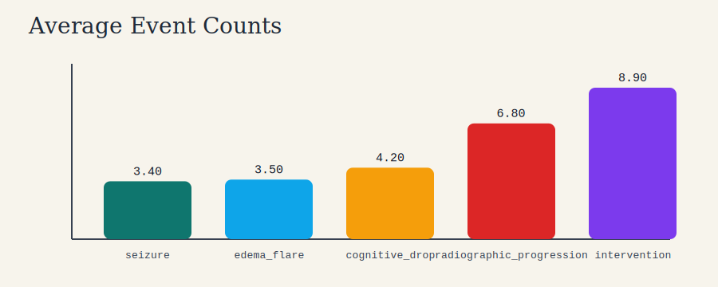
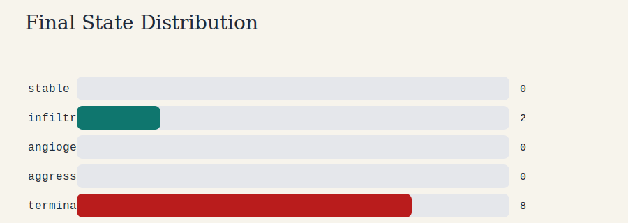
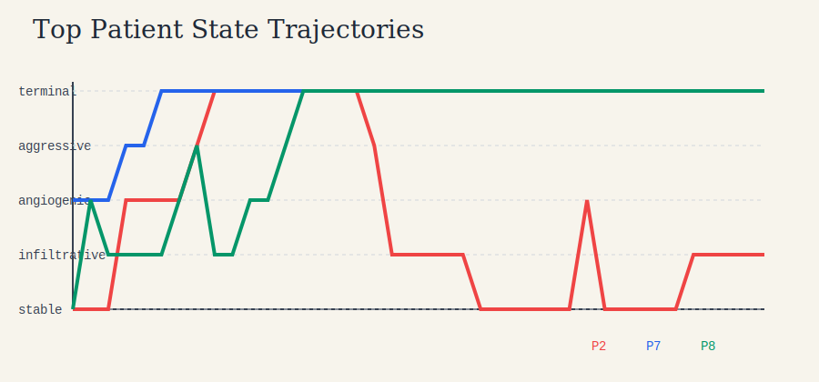

# Glioma Event Dynamics Report

## Summary

- Synthetic patients analyzed: 10
- Mean instability score: 29.895
- Mean total events per patient: 26.80
- Input dataset rows: 10
- Input source: `glioma_event_lab\sample_data.csv`

## Figures







## Highest-Risk Patients

```json
[
  {
    "patient_id": 8,
    "age": 39.0,
    "grade": 3,
    "methylated": 1,
    "tumor_volume": 25.1,
    "resection_extent": 0.711,
    "final_state": "terminal",
    "instability_score": 43.2,
    "seizure": 3,
    "edema_flare": 1,
    "cognitive_drop": 10,
    "radiographic_progression": 10,
    "intervention": 8
  },
  {
    "patient_id": 7,
    "age": 51.0,
    "grade": 4,
    "methylated": 1,
    "tumor_volume": 34.8,
    "resection_extent": 0.772,
    "final_state": "terminal",
    "instability_score": 34.6,
    "seizure": 6,
    "edema_flare": 3,
    "cognitive_drop": 4,
    "radiographic_progression": 8,
    "intervention": 9
  },
  {
    "patient_id": 2,
    "age": 35.0,
    "grade": 3,
    "methylated": 1,
    "tumor_volume": 25.55,
    "resection_extent": 0.78,
    "final_state": "infiltrative",
    "instability_score": 32.65,
    "seizure": 5,
    "edema_flare": 8,
    "cognitive_drop": 4,
    "radiographic_progression": 7,
    "intervention": 4
  },
  {
    "patient_id": 6,
    "age": 66.0,
    "grade": 4,
    "methylated": 0,
    "tumor_volume": 60.95,
    "resection_extent": 0.614,
    "final_state": "terminal",
    "instability_score": 30.7,
    "seizure": 5,
    "edema_flare": 3,
    "cognitive_drop": 2,
    "radiographic_progression": 10,
    "intervention": 14
  },
  {
    "patient_id": 5,
    "age": 43.0,
    "grade": 3,
    "methylated": 1,
    "tumor_volume": 19.85,
    "resection_extent": 0.788,
    "final_state": "terminal",
    "instability_score": 30.1,
    "seizure": 4,
    "edema_flare": 2,
    "cognitive_drop": 0,
    "radiographic_progression": 5,
    "intervention": 2
  }
]
```

## Interpretation

This run highlights how latent disease severity, recurrent progression, and intervention timing interact over time. The event process is not independent from step to step, so bursts of progression or edema can create cascades that are clinically more realistic than one-shot prediction targets.